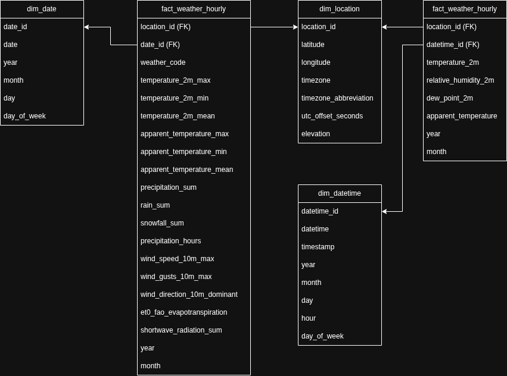

# Pyspark ETL Data Platform

This project focuses on a data ingestion and processing platform built with **Python and PySpark**. 

The pipeline ingests **XML and JSON datasets from public APIs**, persists raw data, parses XML and JSON structures, and produces analytics-ready datasets using a **Bronze / Silver / Gold** architecture.

The goal of this repository is to showcase:
- Scalable ingestion from external APIs
- XML and JSON parsing using PySpark
- Data software architecture
- Parameterized, testable, and production-ready code

---

## Architecture Overview


src/ \
├── ingestion/ ( API-specific ingestion logic) \
├── raw/ (Raw XML persistence (Bronze)) \
├── processing/ (XML-JSON → DataFrame Silver parsing) \
├── aggregation/ (Aggregation logic for gold tables) \
├── common/ (Spark, config, logging utilities) \
└── jobs/ (ETL jobs) 

configs/ \
└── *.yaml (Dataset-specific configuration) 

data/ \
├── raw/ (Bronze layer)\
├── silver/ \
└── gold/ 


---

## Data Flow

1. **Configuration-driven execution**
   - Datasets, filters, and storage paths are defined via YAML.
2. **API ingestion**
   - XML and JSON data is retrieved using HTTP clients with validation.
3. **Raw persistence (Bronze)**
   - Original XML and JSON data is stored without transformation.
4. **Parsing & normalization (Silver)**
   - XML and JSON parsing logic.
   - Schemas are applied and types normalized.
5. **Transformations & aggregations (Gold)**
   - Data is aggregated and prepared for analytics use cases.
6. **Optimized storage**
   - Output is written as partitioned Parquet.

---

Designed to run:
- Locally
- On Databricks
- Spark standalone clusters

---
## Data Modeling

### Open Meteo Data



### Grain Definitions

| Table | Grain |
|-------|-------|
| `fact_weather_daily` | 1 row per location per day |
| `fact_weather_hourly` | 1 row per location per hour |
| `dim_location` | 1 row per geographic location |
| `dim_date` | 1 row per calendar date |
| `dim_datetime` | 1 row per timestamp (hour) |

---
<details>

### Fact and Dimension details

### Fact Tables

#### fact_weather_daily

Grain:
> One record per location per calendar day

#### Foreign Keys
- `location_id`
- `date_id`

#### Metrics
- temperature_2m_max
- temperature_2m_min
- temperature_2m_mean
- precipitation_sum
- rain_sum
- snowfall_sum
- wind_speed_10m_max
- shortwave_radiation_sum
- et0_fao_evapotranspiration
- weather_code

Partitioned by:
- year
- month

---

#### fact_weather_hourly

Grain:
> One record per location per hour

#### Foreign Keys
- `location_id`
- `datetime_id`

#### Metrics
- temperature_2m
- relative_humidity_2m
- dew_point_2m
- apparent_temperature
- precipitation
- wind_speed_10m
- wind_direction_10m

Partitioned by:
- year
- month

---

### Dimension Tables

#### dim_location

Stores geographic metadata.

| Column | Description |
|--------|------------|
| location_id | Surrogate key |
| latitude | Latitude coordinate |
| longitude | Longitude coordinate |
| timezone | Timezone string |
| timezone_abbreviation | Timezone abbreviation |
| utc_offset_seconds | UTC offset |
| elevation | Elevation in meters |

Shared across daily and hourly facts.

---

#### dim_date

Grain:
> One row per date

| Column | Description |
|--------|------------|
| date_id | Surrogate key |
| date | Calendar date |
| year | Year |
| month | Month |
| day | Day of month |
| day_of_week | Day of week |
| quarter | Quarter |

Used by:
- `fact_weather_daily`

---

#### dim_datetime

Grain:
> One row per hour timestamp

| Column | Description |
|--------|------------|
| datetime_id | Surrogate key |
| timestamp | Full timestamp |
| date | Date portion |
| year | Year |
| month | Month |
| day | Day |
| hour | Hour of day |
| day_of_week | Day of week |

Used by:
- `fact_weather_hourly`

---

### Gold Layer – Business Aggregations

The Gold layer contains aggregated, analytics-ready tables to be used in BI reporting and applications.

---

#### gold_weather_climate_trends

Grain:
> One row per location per year

Metrics:
- yearly_avg_temp
- yearly_total_rain
- yearly_total_snow
- yearly_avg_wind
- rainfall_variability
- temperature_volatility
- hottest_month
- coldest_month

Purpose:
- Long-term climate analysis
- Trend detection
- Year-over-year comparisons

---

##### gold_weather_hourly_patterns

Grain:
> One row per location per hour_of_day

Metrics:
- avg_temp_by_hour
- avg_humidity_by_hour
- avg_wind_by_hour
- total_precipitation_by_hour

Purpose:
- Intraday weather pattern analysis
- Time-of-day trends
- Operational forecasting insights

---
</details>

### Eurostat data
### Grain Definitions

| Table | Grain |
|-------|-------|
| `gold_demographics_indicators` | 1 row per Country (geo) + Year |

## Schema

| Column | Type | Description |
|-------|------|------------|
| geo | STRING | Country code (Eurostat geographic identifier) |
| year | INT | Reference year |
| median_age_total | DOUBLE | Median age of total population |
| median_age_male | DOUBLE | Median age of male population |
| median_age_female | DOUBLE | Median age of female population |
| dependency_ratio | DOUBLE | Age dependency ratio |

---

## Indicator Mapping

| Eurostat Code | Column Name |
|--------------|------------|
| MEDAGEPOP | median_age_total |
| MMEDAGEPOP | median_age_male |
| FMEDAGEPOP | median_age_female |
| DEPRATIO1 | dependency_ratio |


## How to Run it

### 1. Install dependencies

1. Clone repository
2. Activate/Create virtual environment in the root of the project:

```bash
source venv/bin/activate
```

3. Install the requirements:

```bash
pip install -r requirements.txt
```

4. Install project (Editable Mode) 
``` bash
pip install --upgrade pip
pip install -e .
```

4. To Run the project you can run the jobs files (open_meteo_json_parser):
``` bash
python -m src.jobs.ingest_open_meteo configs/data_ingestion_open_meteo.yaml

python -m src.jobs.ingest_eurostat configs/eurostat_demo_r_pjanind3.yaml
```

5. If using Spark directly:

``` bash
spark-submit --master local[*] src/jobs/ingest_open_meteo.py configs/data_ingestion_open_meteo.yaml

spark-submit --master local[*] src.jobs.ingest_eurostat configs/eurostat_demo_r_pjanind3.yaml
```