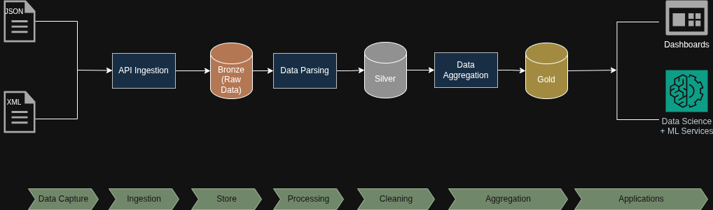

# Pyspark ETL Data Platform

This project focuses on a data ingestion and processing platform built with **Python and PySpark**. 

The pipeline ingests **XML and JSON datasets from public APIs**, persists raw data, parses XML and JSON structures, and produces analytics-ready datasets using a **Bronze / Silver / Gold** architecture.

The goal of this repository is to showcase:
- Scalable ingestion from external APIs
- XML and JSON parsing using PySpark
- Data software architecture
- Parameterized, testable, and production-ready code

---

## Architecture Overview



src/ \
├── ingestion/ ( API-specific ingestion logic) \
├── raw/ (Raw XML persistence (Bronze)) \
├── processing/ (XML → DataFrame parsing) \
├── transformations/ (Business logic (Silver/Gold)) \
├── jobs/ (Pipeline entrypoints) \
├── common/ (Spark, config, logging utilities) \
└── utils/ (File system & helpers) \

configs/ \
└── *.yaml (Dataset-specific configuration) 

data/ \
├── raw/ \
├── processed/ \
└── curated/ \


---

## Data Flow

1. **Configuration-driven execution**
   - Datasets, filters, and storage paths are defined via YAML.
2. **API ingestion**
   - XML and JSON data is retrieved using HTTP clients with validation.
3. **Raw persistence (Bronze)**
   - Original XML and JSON data is stored without transformation.
4. **Parsing & normalization (Silver)**
   - XML is parsed using PySpark (`spark-xml`).
   - Schemas are applied and types normalized.
5. **Transformations & aggregations (Gold)**
   - Data is aggregated and prepared for analytics use cases.
6. **Optimized storage**
   - Output is written as partitioned Parquet.

---

Designed to run:
- Locally
- On Databricks
- Spark standalone clusters

---

## How to Run Locally

### 1. Install dependencies
```bash
1. Clone repository
2. Activate virtual environment with `source venv/bin/activate` in the root of project
3. Install the requirements with `pip install -r requirements.txt`
4. To Run the project you can run the jobs files (open_meteo_json_parser)
